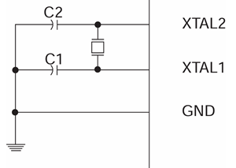
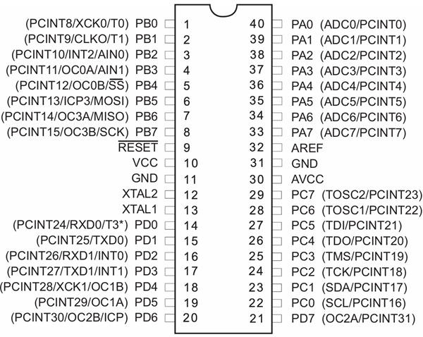

# SuperKey Hardware Guide

This guide describes the SuperKey's hardware.

## Microcontroller

The SuperKey uses an [ATmega1284P microcontroller](https://www.microchip.com/en-us/product/ATmega1284p), currently
produced by [Microchip Technology](https://www.microchip.com/). The datasheet for the ATmega1284P is available at
[this link](https://ww1.microchip.com/downloads/en/DeviceDoc/ATmega164A_PA-324A_PA-644A_PA-1284_P_Data-Sheet-40002070B.pdf).
The microcontroller uses a [dual inline package (DIP)](https://en.wikipedia.org/wiki/Dual_in-line_package)
configuration, since this is the easiest type of integrated circuit for hobbyists to work with.

### Clock

The device uses a crystal oscillator with a frequency of 16 MHz as its primary clock inputs. This is connected to the
`XTAL1` and `XTAL2` pins as shown in the schematic.



### Fuses

The microcontroller fuse configuration was calculated using [this site](https://www.engbedded.com/fusecalc/). The fuses
are set for the following options:

- External Crystal Oscillator
  - Frequency 8.0+ MHz
  - Start-up time 16K clocks + 0 ms
- Enable SPI programming
- Enable JTAG
- Enable brown-out detection at 2.7 V

This leads to the following fuse bytes:

- Low: `0xDF`
- High: `0x99`
- Extended: `0xFD`

The fuses can be programmed with the following `avrdude` command:

```
avrdude -c avrispmkii -P usb -p m1284p -U lfuse:w:0xdf:m -U hfuse:w:0x99:m -U efuse:w:0xfd:m
```

### Pinout

The pinout for the ATmega1284P is shown below:



### Pin Assignments

The current pin assignments are shown in the table below. Pins which are not listed are currently unassigned.

| Pin | Function | Description                | Notes                     |
|-----|----------|----------------------------|---------------------------|
| 6   | `MOSI`   | SPI Controller Out         | Only used for programming |
| 7   | `MISO`   | SPI Controller In          | Only used for programming |
| 8   | `SCK`    | SPI Clock                  | Only used for programming |
| 9   | `RESET`  | Reset Device               |                           |
| 10  | `VCC`    | Power                      |                           |
| 11  | `GND`    | Ground                     |                           |
| 12  | `XTAL2`  | Crystal Oscillator Input 2 |                           |
| 13  | `XTAL1`  | Crystal Oscillator Input 1 |                           |
| 14  | `RXD0`   | Interface Port UART RX     |                           |
| 15  | `TXD0`   | Interface Port UART TX     |                           |
| 16  | `RXD1`   | Debug Port UART RX         |                           |
| 17  | `TXD1`   | Debug Port UART TX         |                           |
| 19  | `OC1A`   | Buzzer Output              |                           |
| 20  | `PD6`    | Key LED                    | Active high               |
| 21  | `PD7`    | Status LED                 | Active high               |
| 30  | `AVCC`   | ADC Power                  | ADC is currently unused   |
| 31  | `GND`    | Ground                     |                           |
| 32  | `AREF`   | ADC Reference Voltage      | ADC is currently unused   |
| 33  | `PA7`    | Output TRS Ring            |                           |
| 34  | `PA6`    | Output TRS Tip             |                           |
| 35  | `PA5`    | Input TRS 2 Ring           |                           |
| 36  | `PA4`    | Input TRS 2 Tip            |                           |
| 37  | `PA3`    | Input TRS 1 Ring           |                           |
| 38  | `PA2`    | Input TRS 1 Tip            |                           |
| 39  | `PA1`    | Input TRS 0 Ring           |                           |
| 40  | `PA0`    | Input TRS 0 Tip            |                           |

## Firmware Upload

The executable is uploaded to the MCU using [`avrdude`](https://www.nongnu.org/avrdude/) and an
[AVRISP mkII programmer](https://a.co/d/59zSwb5).

```
avrdude -c avrispmkii -P usb -p m1284p -U flash:w:superkey.ihex -D
```
