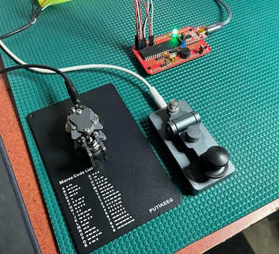
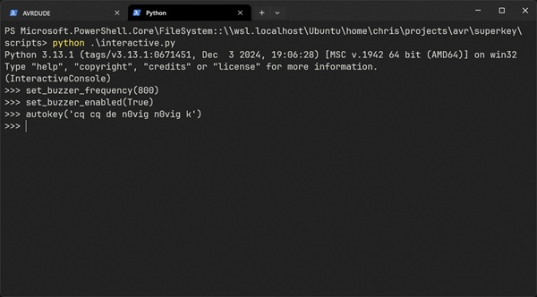

# SuperKey

**SuperKey** - the greatest CW keyer the world has ever seen.

SuperKey is a fully featured, open source CW / Morse code keyer for amateur radio operators. The goal of SuperKey is to
provide **all keyer functionality** required by the modern ham radio enthusiast, as simply and cheaply as possible.
SuperKey is **100% open source**, and always will be - you are free to build, modify, and tinker with your own SuperKey.





## Features

SuperKey provides many useful features for hams:

- Supports **all types of CW keys** — straight key, paddles, bugs, sideswipers, etc.

- Supports **all common paddle modes** — iambic, ultimatic, etc.

- Supports **all types of radios** — if it has a keyer input, you can connect a SuperKey to it.

- Connects **multiple keys to a single radio** — no need to choose between straight key and paddles!

- Connects **multiple radios to a single key** — if that's something you need to do (🤨), SuperKey can do it for you.

- Allows **keyboard text entry and automatic Morse code generation** with autokeyer support.

- Supports speeds from **1 WPM to 100 WPM**, with **exact timing control** of all Morse code elements.

- Keyer output is **millisecond accurate**, verified by oscilloscope.

- Hardware **LED and buzzer output** — practice when you're away from your radio, even silently!

- All functionality is **programmable via a Python interface**, allowing advanced use cases.

SuperKey is under active development as of August 2025. The prototype hardware is continuing to evolve, and new features
are being added continuously.

## Documentation

- [User's Guide](doc/user-guide.md) - **NEW USERS START HERE!** User-focused instruction manual for the SuperKey.
- [Developer's Guide](doc/developer-guide.md) - Documentation for developers who want to modify the SuperKey software.
- [Hardware Guide](doc/hardware-guide.md) - Description of SuperKey hardware and how to build it.

## Build Status

[](https://github.com/xchrishawk/superkey/actions/workflows/build-atmega1284p-debug.yaml)<br/>
[](https://github.com/xchrishawk/superkey/actions/workflows/build-atmega1284p-release.yaml)

These workflows may also be used as a reference example of setting up a SuperKey development workspace.

## Credits

SuperKey is designed and maintained by [Chris Vig](mailto:chris@invictus.so) ([`N0VIG`](https://www.qrz.com/db/N0VIG)).

## Copyright / License

SuperKey is licensed under the GPLv3 license. See the [LICENSE](LICENSE) file for details.


```
Copyright (C) 2025 Chris Vig.

This program is free software: you can redistribute it and/or modify
it under the terms of the GNU General Public License as published by
the Free Software Foundation, either version 3 of the License, or
(at your option) any later version.

This program is distributed in the hope that it will be useful,
but WITHOUT ANY WARRANTY; without even the implied warranty of
MERCHANTABILITY or FITNESS FOR A PARTICULAR PURPOSE.  See the
GNU General Public License for more details.

You should have received a copy of the GNU General Public License
along with this program.  If not, see <https://www.gnu.org/licenses/>.
```
